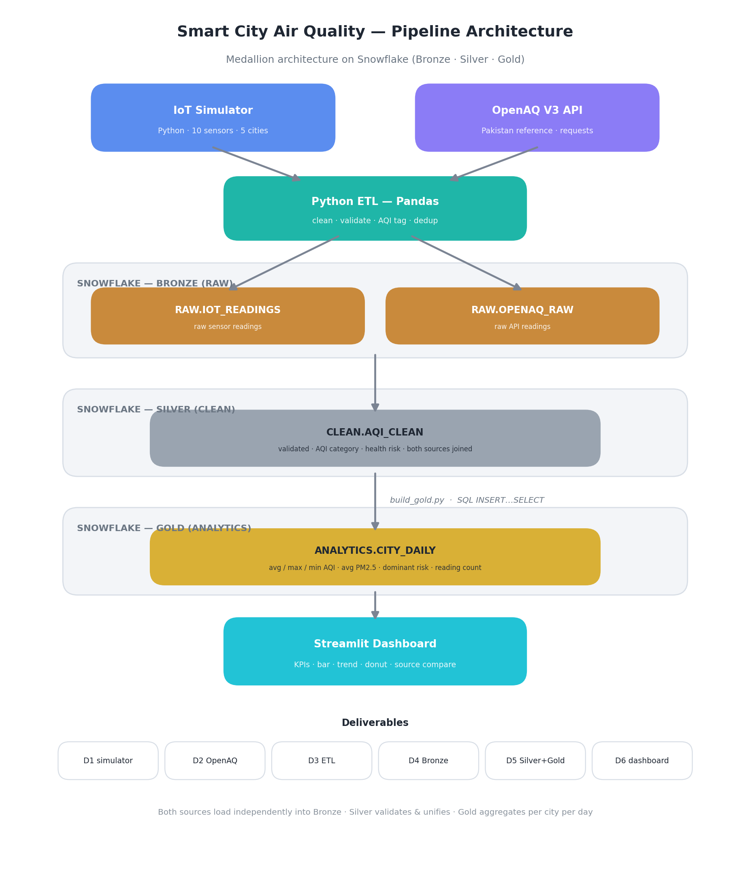

# Architecture

Smart City Air Quality Monitoring System — an end-to-end data pipeline that
generates and ingests air-quality data, refines it through a medallion
architecture on Snowflake, and serves it to a live dashboard.

## Overview

The system brings together two independent data sources — a simulated IoT
sensor network and the real OpenAQ V3 API — and processes them through three
Snowflake layers (Bronze → Silver → Gold) before presenting them in a Streamlit
dashboard. The goal is to compare simulated readings against real monitoring
stations, tag pollution severity, and surface daily air-quality KPIs per city.

## Data sources

**IoT Simulator (`src/iot_simulator.py`).** A Python script standing in for
physical hardware. It emulates 10 sensors across Karachi, Lahore, Islamabad,
Peshawar and Multan, producing one reading per sensor every 10 seconds with
realistic zone-based pollution levels, a time-of-day effect, and occasional
anomaly spikes. Each reading is written to a local CSV and inserted into
Snowflake Bronze.

**OpenAQ V3 API (`src/openaq_fetcher.py`).** Pulls real reference measurements
for Pakistan monitoring stations (locations → sensors → latest values) and
loads them into Snowflake Bronze. Used for comparison and validation against
the simulated data.

## Medallion layers (Snowflake)

**Bronze — `RAW` schema.** Raw data exactly as it arrives, one table per
source: `RAW.IOT_READINGS` and `RAW.OPENAQ_RAW`. No cleaning, so the original
data is always recoverable.

**Silver — `CLEAN` schema.** `CLEAN.AQI_CLEAN` holds validated, enriched rows
from both sources in one unified shape. The ETL drops nulls and out-of-range
values, deduplicates, tags each row with an EPA AQI category and a health-risk
level (LOW / MEDIUM / HIGH / CRITICAL), and stamps a processing time.

**Gold — `ANALYTICS` schema.** `ANALYTICS.CITY_DAILY` aggregates Silver into one
row per city per day: average/max/min AQI, average PM2.5, average CO₂, the
dominant health risk, and a total reading count. This is the layer the
dashboard reads.

## Processing

**ETL (`src/etl_pipeline.py`).** A Pandas pipeline that reads both Bronze
tables, applies the cleaning and enrichment rules, unifies the two sources into
the Silver shape, and loads `CLEAN.AQI_CLEAN`. The shared EPA AQI math lives in
`src/aqi_utils.py` so the simulator and ETL use identical formulas.

**Gold build (`build_gold.py` / `sql/02_gold_aggregate.sql`).** Aggregates
Silver into the Gold daily table with a single `INSERT … SELECT … GROUP BY`.
Either the Python script or the SQL file does the same job.

## Dashboard

**Streamlit (`dashboard/streamlit_app.py`).** A dark-themed live dashboard that
queries the Gold and Silver layers directly. It shows KPI cards, average AQI per
city, a sensor trend line, a risk-distribution donut, a simulated-vs-OpenAQ
comparison, and a color-coded city risk board. Data is cached with a 30-second
TTL, and the sidebar offers a city filter and an adjustable trend window.

## Technology stack

| Layer | Technology |
|-------|------------|
| Data generation | Python (`random`, `datetime`) |
| Reference data | OpenAQ V3 REST API + `requests` |
| ETL | Python + Pandas |
| Storage / warehouse | Snowflake (Bronze / Silver / Gold) |
| Warehouse driver | `snowflake-connector-python` |
| Dashboard | Streamlit + Plotly |
| Config | `.env` via `python-dotenv` |

## End-to-end flow

1. IoT simulator and OpenAQ fetcher load raw data independently into **Bronze**.
2. The Pandas **ETL** cleans, validates, enriches and unifies both into **Silver**.
3. A SQL aggregation rolls Silver up into the **Gold** daily table.
4. The **Streamlit** dashboard reads Gold and Silver and renders live KPIs.
